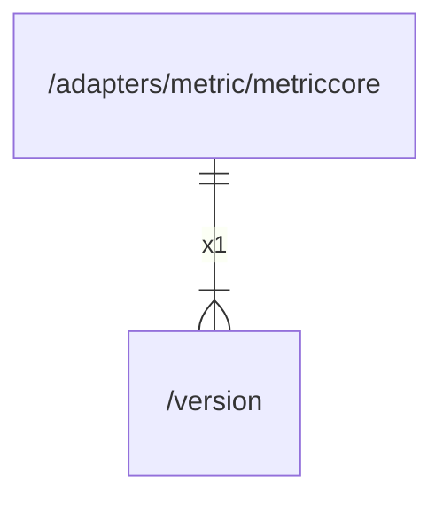

# version

## Imports

|  Name   |  Path   | Inner | Count |
|:-------:|:-------:|:-----:|:-----:|
| runtime | runtime |  ❌   |   1   |

## Used by

|    Name    |                             Path                             |
|:----------:|:------------------------------------------------------------:|
| metriccore | [/adapters/metric/metriccore](adapters/metric/metriccore.md) |

## Scheme

---

> Generated by [goArchLint](https://github.com/gbh007/goarchlint)
