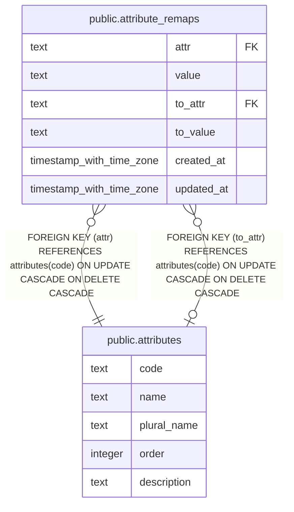

# public.attribute_remaps

## Description

## Columns

| Name | Type | Default | Nullable | Children | Parents | Comment |
| ---- | ---- | ------- | -------- | -------- | ------- | ------- |
| attr | text |  | false |  | [public.attributes](public.attributes.md) |  |
| value | text |  | false |  |  |  |
| to_attr | text |  | true |  | [public.attributes](public.attributes.md) |  |
| to_value | text |  | true |  |  |  |
| created_at | timestamp with time zone |  | false |  |  |  |
| updated_at | timestamp with time zone |  | true |  |  |  |

## Constraints

| Name | Type | Definition |
| ---- | ---- | ---------- |
| attribute_remaps_attr_fkey | FOREIGN KEY | FOREIGN KEY (attr) REFERENCES attributes(code) ON UPDATE CASCADE ON DELETE CASCADE |
| attribute_remaps_to_attr_fkey | FOREIGN KEY | FOREIGN KEY (to_attr) REFERENCES attributes(code) ON UPDATE CASCADE ON DELETE CASCADE |
| attribute_remaps_pkey | PRIMARY KEY | PRIMARY KEY (attr, value) |

## Indexes

| Name | Definition |
| ---- | ---------- |
| attribute_remaps_pkey | CREATE UNIQUE INDEX attribute_remaps_pkey ON public.attribute_remaps USING btree (attr, value) |

## Relations

---

> Generated by [tbls](https://github.com/k1LoW/tbls)
