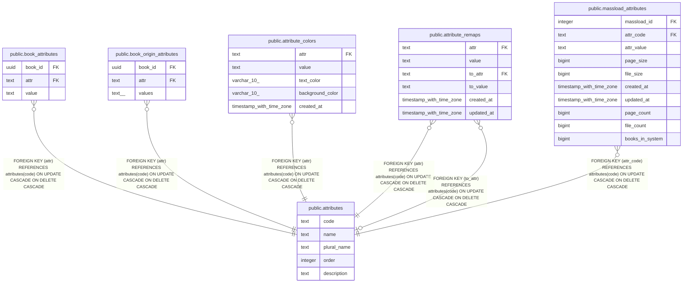

# public.attributes

## Description

## Columns

| Name | Type | Default | Nullable | Children | Parents | Comment |
| ---- | ---- | ------- | -------- | -------- | ------- | ------- |
| code | text |  | false | [public.book_attributes](public.book_attributes.md) [public.book_origin_attributes](public.book_origin_attributes.md) [public.attribute_colors](public.attribute_colors.md) [public.attribute_remaps](public.attribute_remaps.md) [public.massload_attributes](public.massload_attributes.md) |  |  |
| name | text |  | false |  |  |  |
| plural_name | text |  | false |  |  |  |
| order | integer | 999 | false |  |  |  |
| description | text |  | true |  |  |  |

## Constraints

| Name | Type | Definition |
| ---- | ---- | ---------- |
| attributes_pkey | PRIMARY KEY | PRIMARY KEY (code) |

## Indexes

| Name | Definition |
| ---- | ---------- |
| attributes_pkey | CREATE UNIQUE INDEX attributes_pkey ON public.attributes USING btree (code) |

## Relations

---

> Generated by [tbls](https://github.com/k1LoW/tbls)
