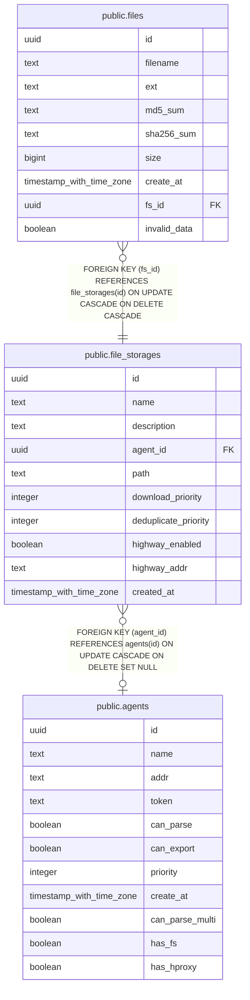

# public.file_storages

## Description

## Columns

| Name | Type | Default | Nullable | Children | Parents | Comment |
| ---- | ---- | ------- | -------- | -------- | ------- | ------- |
| id | uuid |  | false | [public.files](public.files.md) |  |  |
| name | text |  | false |  |  |  |
| description | text |  | true |  |  |  |
| agent_id | uuid |  | true |  | [public.agents](public.agents.md) |  |
| path | text |  | true |  |  |  |
| download_priority | integer | 0 | false |  |  |  |
| deduplicate_priority | integer | 0 | false |  |  |  |
| highway_enabled | boolean | false | false |  |  |  |
| highway_addr | text |  | true |  |  |  |
| created_at | timestamp with time zone |  | false |  |  |  |

## Constraints

| Name | Type | Definition |
| ---- | ---- | ---------- |
| file_storages_agent_id_fkey | FOREIGN KEY | FOREIGN KEY (agent_id) REFERENCES agents(id) ON UPDATE CASCADE ON DELETE SET NULL |
| file_storages_pkey | PRIMARY KEY | PRIMARY KEY (id) |

## Indexes

| Name | Definition |
| ---- | ---------- |
| file_storages_pkey | CREATE UNIQUE INDEX file_storages_pkey ON public.file_storages USING btree (id) |

## Relations

---

> Generated by [tbls](https://github.com/k1LoW/tbls)
