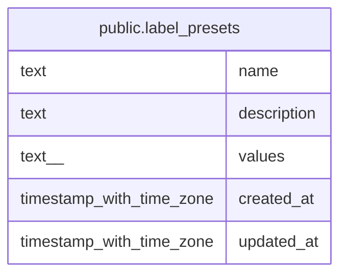

# public.label_presets

## Description

## Columns

| Name | Type | Default | Nullable | Children | Parents | Comment |
| ---- | ---- | ------- | -------- | -------- | ------- | ------- |
| name | text |  | false |  |  |  |
| description | text |  | true |  |  |  |
| values | text[] |  | false |  |  |  |
| created_at | timestamp with time zone |  | false |  |  |  |
| updated_at | timestamp with time zone |  | true |  |  |  |

## Constraints

| Name | Type | Definition |
| ---- | ---- | ---------- |
| label_presets_pkey | PRIMARY KEY | PRIMARY KEY (name) |

## Indexes

| Name | Definition |
| ---- | ---------- |
| label_presets_pkey | CREATE UNIQUE INDEX label_presets_pkey ON public.label_presets USING btree (name) |

## Relations

---

> Generated by [tbls](https://github.com/k1LoW/tbls)
