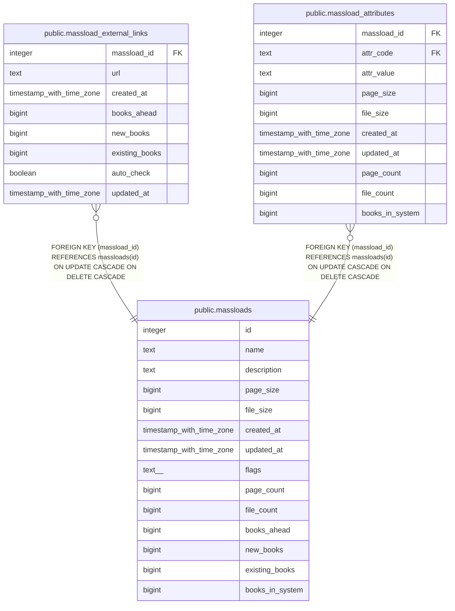

# public.massloads

## Description

## Columns

| Name | Type | Default | Nullable | Children | Parents | Comment |
| ---- | ---- | ------- | -------- | -------- | ------- | ------- |
| id | integer | nextval('massloads_id_seq'::regclass) | false | [public.massload_external_links](public.massload_external_links.md) [public.massload_attributes](public.massload_attributes.md) |  |  |
| name | text |  | false |  |  |  |
| description | text |  | true |  |  |  |
| page_size | bigint |  | true |  |  |  |
| file_size | bigint |  | true |  |  |  |
| created_at | timestamp with time zone |  | false |  |  |  |
| updated_at | timestamp with time zone |  | true |  |  |  |
| flags | text[] |  | true |  |  |  |
| page_count | bigint |  | true |  |  |  |
| file_count | bigint |  | true |  |  |  |
| books_ahead | bigint |  | true |  |  |  |
| new_books | bigint |  | true |  |  |  |
| existing_books | bigint |  | true |  |  |  |
| books_in_system | bigint |  | true |  |  |  |

## Constraints

| Name | Type | Definition |
| ---- | ---- | ---------- |
| massloads_pkey | PRIMARY KEY | PRIMARY KEY (id) |

## Indexes

| Name | Definition |
| ---- | ---------- |
| massloads_pkey | CREATE UNIQUE INDEX massloads_pkey ON public.massloads USING btree (id) |

## Relations

---

> Generated by [tbls](https://github.com/k1LoW/tbls)
