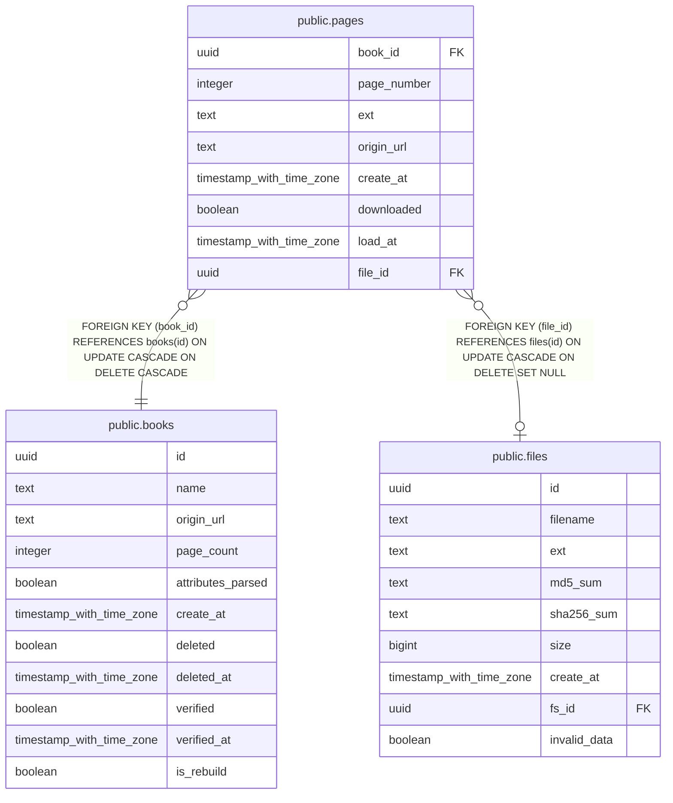

# public.pages

## Description

## Columns

| Name | Type | Default | Nullable | Children | Parents | Comment |
| ---- | ---- | ------- | -------- | -------- | ------- | ------- |
| book_id | uuid |  | false |  | [public.books](public.books.md) |  |
| page_number | integer |  | false |  |  |  |
| ext | text |  | false |  |  |  |
| origin_url | text |  | true |  |  |  |
| create_at | timestamp with time zone |  | false |  |  |  |
| downloaded | boolean | false | false |  |  |  |
| load_at | timestamp with time zone |  | true |  |  |  |
| file_id | uuid |  | true |  | [public.files](public.files.md) |  |

## Constraints

| Name | Type | Definition |
| ---- | ---- | ---------- |
| pages_book_id_fkey | FOREIGN KEY | FOREIGN KEY (book_id) REFERENCES books(id) ON UPDATE CASCADE ON DELETE CASCADE |
| pages_file_id_fkey | FOREIGN KEY | FOREIGN KEY (file_id) REFERENCES files(id) ON UPDATE CASCADE ON DELETE SET NULL |
| pages_pkey | PRIMARY KEY | PRIMARY KEY (book_id, page_number) |

## Indexes

| Name | Definition |
| ---- | ---------- |
| pages_pkey | CREATE UNIQUE INDEX pages_pkey ON public.pages USING btree (book_id, page_number) |
| unloaded_pages | CREATE INDEX unloaded_pages ON public.pages USING btree (book_id, page_number) WHERE (downloaded = false) |
| page_without_file | CREATE INDEX page_without_file ON public.pages USING btree (book_id, page_number) WHERE (file_id IS NULL) |
| page_with_file | CREATE INDEX page_with_file ON public.pages USING btree (file_id, book_id, page_number) WHERE (file_id IS NOT NULL) |
| page_origin_url | CREATE INDEX page_origin_url ON public.pages USING hash (origin_url) WHERE (origin_url IS NOT NULL) |
| page_only_file_id | CREATE INDEX page_only_file_id ON public.pages USING btree (file_id) WHERE (file_id IS NOT NULL) |

## Relations

---

> Generated by [tbls](https://github.com/k1LoW/tbls)
